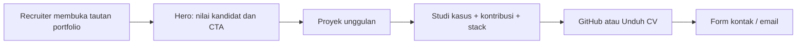

# Product Requirements Document (PRD)

## Portfolio Web - Rafly Maulana Zulyzar

**Versi:** 1.0  
**Status:** Siap dikembangkan  
**Target rilis MVP:** 2-3 minggu  
**Platform:** Web responsif, bilingual (Indonesia / English)  
**Rekomendasi stack:** Laravel 11, Blade, Tailwind CSS, Alpine.js, Vite, MySQL/SQLite

## 1. Ringkasan produk

Situs ini adalah portfolio profesional personal untuk membantu Rafly Maulana Zulyzar mendapatkan peluang kerja entry-level/junior pada peran Web Developer, Junior Data Analyst, atau IT Support. Situs harus membuat recruiter memahami nilai kandidat dalam kurang dari satu menit: mampu membangun aplikasi web end-to-end, memiliki pengalaman Help Desk nyata, serta pernah mengerjakan proyek AI, data, dan IoT.

Produk bukan sekadar halaman CV digital. Fokusnya adalah bukti kerja: studi kasus yang dapat dibaca cepat, tautan source code, keputusan teknis, kontribusi kandidat, dan cara menghubungi kandidat.

## 2. Konteks kandidat dan proposisi nilai

| Area | Bukti yang ditampilkan |
|---|---|
| Pendidikan | S1 Teknik Informatika, Universitas Komputer Indonesia, IPK 3.59 (2021-2026) |
| Pengalaman | Web Developer, ISBI Bandung (Sep-Des 2024): analisis kebutuhan reporting, Help Desk TI, dan dashboard manajemen gudang |
| Keahlian inti | Laravel/PHP, Python, web development, data analysis, technical writing, IT support |
| Kredensial | BNSP Junior Web Developer (berlaku Mei 2025-Mei 2027), TOEFL, IBM AI Fundamentals, Cisco Networking/Cybersecurity |

**Pesan hero yang direkomendasikan:**  
“Web Developer focused on practical Laravel solutions, data-driven interfaces, and AI-enabled products.”

**Penting:** jangan menampilkan alamat rumah atau nomor telepon publik. Kontak yang ditampilkan cukup email, GitHub, LinkedIn (jika tersedia), dan formulir kontak terlindungi spam.

## 3. Sasaran dan metrik keberhasilan

### Sasaran

1. Membuat recruiter dapat menilai profil, pengalaman, dan proyek utama dalam satu sesi singkat.
2. Menampilkan kemampuan Laravel sebagai fondasi utama, tanpa menyembunyikan kemampuan Python/AI/Data.
3. Mengarahkan pengunjung ke GitHub, CV PDF, dan kanal kontak.
4. Menyediakan pengalaman yang cepat, profesional, mudah dibaca, dan aksesibel pada desktop maupun mobile.

### Metrik MVP

| Metrik | Target awal |
|---|---:|
| Core Web Vitals mobile | LCP < 2.5 detik pada koneksi standar |
| Aksesibilitas | Skor Lighthouse >= 90 |
| Navigasi proyek | Pengunjung dapat mencapai detail proyek dalam <= 2 klik |
| Konversi | Klik CV / GitHub / kontak tercatat sebagai event analitik |
| Kontak | Pesan valid masuk email tanpa mengekspos alamat email pada halaman |

## 4. Pengguna utama dan kebutuhan

| Pengguna | Kebutuhan | Aksi utama |
|---|---|---|
| Recruiter/HR | Memvalidasi kecocokan kandidat secara cepat | Membaca ringkasan, pengalaman, skill, unduh CV |
| Hiring manager/technical interviewer | Menilai kedalaman praktik dan kontribusi | Membuka studi kasus, repo, teknologi, dan tantangan teknis |
| Calon kolaborator | Memahami ruang kerja sama | Meninjau proyek, peran, dan menghubungi Rafly |
| Rafly (admin) | Memperbarui portfolio tanpa mengubah kode | Mengelola proyek, skill, sertifikasi, dan pesan masuk |

## 5. Ruang lingkup MVP

### 5.1 Arsitektur informasi

```text
Beranda
|- Tentang
|- Pengalaman
|- Proyek
|  |- Nutriscan
|  |- DataChatbot
|  |- ParkHere
|  |- GenAI Art
|- Keahlian dan Sertifikasi
|- Kontak
|- Detail Proyek (dinamis per slug)
|- Unduh CV
`- Admin (terproteksi)
```

### 5.2 Beranda

- Hero dengan nama, peran target, ringkasan 1-2 kalimat, serta CTA: **Lihat Proyek**, **Unduh CV**, dan **Hubungi Saya**.
- Visual hero minimalis berbasis gradient/mesh dan elemen kode abstrak; gunakan foto profesional hanya bila tersedia dan berkualitas baik.
- Highlight metrik yang faktual: IPK 3.59, 1 pengalaman Web Developer, 4 proyek unggulan, sertifikasi BNSP.
- Navigasi sticky dengan switch bahasa dan toggle tema gelap/terang.
- Animasi halus hanya sebagai progressive enhancement; situs tetap nyaman saat `prefers-reduced-motion` aktif.

### 5.3 Tentang dan pengalaman

- Ringkasan profesional berbasis CV, tanpa klaim berlebihan.
- Timeline pengalaman ISBI Bandung: analisis alur reporting, pembangunan Help Desk untuk isu TI (Wi-Fi, proyektor, komputer), serta dashboard gudang untuk staf TIK/Jaringan.
- Timeline pendidikan dan sertifikasi yang dapat dipindai cepat.
- Daftar skill dikelompokkan: **Web** (Laravel, PHP, Blade, Tailwind), **Data/AI** (Python, Pandas, Plotly, LLM API), dan **IT** (networking, troubleshooting, dokumentasi).

### 5.4 Galeri proyek

- Empat kartu proyek dengan thumbnail, kategori, peran, ringkasan, teknologi, dan CTA **Lihat Studi Kasus** serta **GitHub**.
- Filter interaktif: Semua, Laravel/Web, AI, Data, IoT.
- Semua informasi kontribusi tim harus eksplisit; jangan menampilkan karya tim sebagai kerja individual.

### 5.5 Detail proyek

Setiap studi kasus harus memiliki struktur konsisten:

1. tujuan/masalah;
2. solusi dan pengguna sasaran;
3. kontribusi Rafly;
4. fitur utama;
5. stack dan arsitektur ringkas;
6. tantangan/pembelajaran;
7. screenshot atau demo bila tersedia;
8. tautan GitHub dan demo (jika aktif).

## 6. Konten proyek yang disiapkan

| Proyek | Ringkasan yang dipublikasikan | Bukti teknologi / peran | Tautan |
|---|---|---|---|
| Nutriscan - Nutrition Label Scanner | Aplikasi pemindaian label nutrisi untuk membantu pengguna memahami informasi gizi produk. | Deskripsi perlu dilengkapi dari README/demo karena repository belum dapat diinspeksi pada saat penyusunan PRD. Jangan mencantumkan teknologi atau hasil yang belum diverifikasi. | [GitHub](https://github.com/RaflyMZ/Nutriscan) |
| DataChatbot for Analyze Data (Beta 1.0) | Aplikasi Streamlit untuk mengunggah dan menganalisis data melalui percakapan, visualisasi cepat, dan insight otomatis. | Python, Streamlit, Pandas, OpenAI-compatible Groq API, Plotly, Matplotlib, NumPy. Mendukung sesi chat, Bahasa Indonesia/Inggris, rekomendasi chart, dan chart builder. | [GitHub](https://github.com/RaflyMZ/DataChatbot---Chatbot-for-Analyze-data) |
| ParkHere - Smart Parking System | Sistem rekomendasi dan pengelolaan parkir dengan peran admin, petugas, dan pelanggan; mencakup dashboard, pengelolaan lokasi/pengguna, serta laporan transaksi. | Laravel 11, Blade, Tailwind CSS, Alpine.js, Vite. Kontribusi yang dicatat di repo: **IoT** sebagai bagian dari tim; tampilkan sebagai proyek kolaboratif. | [GitHub](https://github.com/Paguyuban-Cogil-Bandung/ParkHere) |
| GenAI Art / AI Image Generator | Aplikasi generative-image: pengguna login, memilih gaya (anime/pastel/realistic), memasukkan prompt dan negative prompt, memilih rasio, menyimpan hasil, download, gallery, dan community feed. | Laravel 10, PHP, MySQL, Vite; proyek tim. Cantumkan peran spesifik Rafly setelah dikonfirmasi agar akurat. | [GitHub](https://github.com/KrakenMiX/AI-Image-Generator) |

## 7. Persyaratan fungsional

| ID | Prioritas | Kebutuhan | Kriteria penerimaan |
|---|---|---|---|
| FR-01 | Must | Pengunjung dapat melihat hero, ringkasan, pengalaman, proyek, skill, sertifikasi, dan kontak pada satu halaman. | Semua section dapat dijangkau dari navigasi dan tautan anchor bekerja. |
| FR-02 | Must | Pengunjung dapat membuka detail dari setiap proyek. | URL stabil: `/projects/{slug}` dan memuat konten sesuai proyek. |
| FR-03 | Must | Tautan GitHub tiap proyek terbuka di tab baru dengan `rel="noopener noreferrer"`. | Keempat tautan benar dan dapat diklik. |
| FR-04 | Must | Pengunjung dapat mengunduh CV terbaru. | Tombol mengirim file PDF versi publik dan event `cv_download` tercatat. |
| FR-05 | Must | Form kontak mengirim nama, email, subjek, dan pesan ke email pemilik. | Validasi, honeypot/rate limit, status sukses/gagal, tanpa menampilkan data sensitif. |
| FR-06 | Should | Konten tersedia dalam Indonesia dan English. | Bahasa yang dipilih bertahan satu sesi dan seluruh label/teks inti berubah. |
| FR-07 | Should | Galeri dapat difilter berdasarkan kategori. | Filter tidak memuat ulang halaman dan tetap dapat digunakan dengan keyboard. |
| FR-08 | Should | Admin dapat CRUD proyek, teknologi, sertifikasi, dan highlight. | Perubahan muncul di situs tanpa deploy kode. |
| FR-09 | Could | Pengunjung dapat melihat proyek unggulan bergantian. | Tidak mengganggu pembacaan atau akses keyboard. |

## 8. Persyaratan nonfungsional

- **Responsif:** mobile-first; breakpoint Tailwind standar; navigasi mobile jelas.
- **Aksesibilitas:** semantic HTML, fokus keyboard terlihat, alt text, kontras AA, heading berurutan, form dengan label nyata.
- **Kinerja:** gambar AVIF/WebP terkompresi dan lazy-load; font lokal/`font-display: swap`; hindari library animasi besar.
- **Keamanan:** Laravel validation, CSRF, rate limiting pada form, sanitasi output, secret hanya di `.env`; tidak ada credential, server URL, atau password dari repository yang ditampilkan.
- **SEO:** metadata per halaman, Open Graph, sitemap, robots, canonical, JSON-LD `Person` dan `CreativeWork`.
- **Privasi:** analytics privacy-friendly/consent-aware; form kontak hanya menyimpan data seperlunya.

## 9. Rekomendasi desain dan implementasi

Gunakan **Laravel 11 + Blade + Tailwind CSS + Alpine.js** sebagai stack produksi. Ini menonjolkan framework yang paling dikuasai kandidat sekaligus menghasilkan situs ringan, mudah dideploy, dan mudah ditambah admin panel. Next.js tidak diperlukan untuk MVP; pilih hanya bila nanti ingin menjadikan portfolio sebagai eksperimen frontend React.

**Arah visual:** editorial-modern, banyak ruang kosong, tipografi tegas, palet navy/indigo sebagai dasar dengan aksen cyan atau lime. Hindari template developer generik dengan progress bar skill dan animasi berlebihan. Fokuskan perhatian pada studi kasus, bukan dekorasi.

**Struktur data minimum:** `projects`, `project_technologies`, `certifications`, `experiences`, `contact_messages`, dan `site_settings`. Untuk MVP yang sangat cepat, content dapat dikelola di file PHP/Markdown; gunakan database/admin hanya jika pembaruan konten akan sering dilakukan.

## 10. Alur pengguna utama



## 11. Di luar ruang lingkup MVP

- Blog/CMS publik dan komentar.
- Login pengunjung.
- Dashboard analitik khusus.
- Menyalin ulang atau menjalankan demo setiap proyek di domain portfolio.
- Klaim angka dampak, pengguna, atau hasil bisnis tanpa bukti yang dapat diverifikasi.

## 12. Rencana implementasi

| Fase | Hasil | Estimasi |
|---|---|---:|
| 1. Fondasi | Sitemap, content inventory, wireframe, design tokens | 1-2 hari |
| 2. Tampilan inti | Beranda, proyek, detail proyek, mobile navigation, tema | 3-5 hari |
| 3. Konversi | CV download, kontak, metadata/SEO, analytics | 1-2 hari |
| 4. Konten dan QA | Screenshot proyek, bilingual copy, accessibility/performance test | 2-3 hari |
| 5. Deploy | Konfigurasi environment, domain, monitoring dasar | 1 hari |

## 13. Keputusan dan informasi yang perlu dikonfirmasi sebelum build

1. URL LinkedIn dan username GitHub yang ingin ditampilkan pada hero/footer.
2. CV PDF publik terbaru serta foto profesional (opsional).
3. Screenshot/demo yang boleh dipakai untuk tiap proyek.
4. Peran spesifik Rafly pada **GenAI Art** dan detail teknis **Nutriscan**.
5. Pilihan domain, hosting, dan alamat email penerima form kontak.

## 14. Definition of Done MVP

- Situs live, HTTPS, responsif, dan lulus pengujian manual desktop/mobile.
- Empat proyek memiliki halaman detail, attribution yang jujur, dan GitHub link valid.
- CV bisa diunduh, form kontak terlindungi dan terkirim.
- Tidak ada alamat rumah, nomor telepon, password, API key, atau kredensial publik.
- Lighthouse Accessibility >= 90 dan tidak ada error console kritis.

